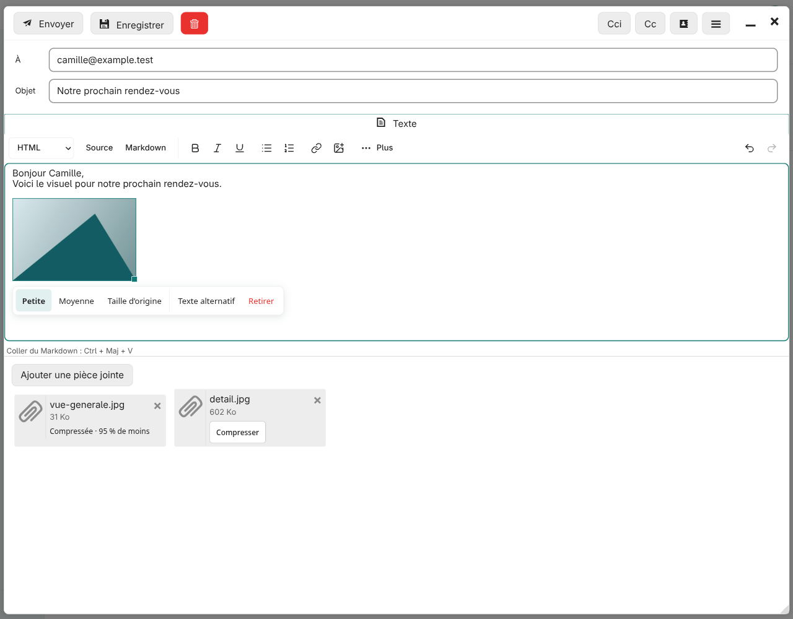
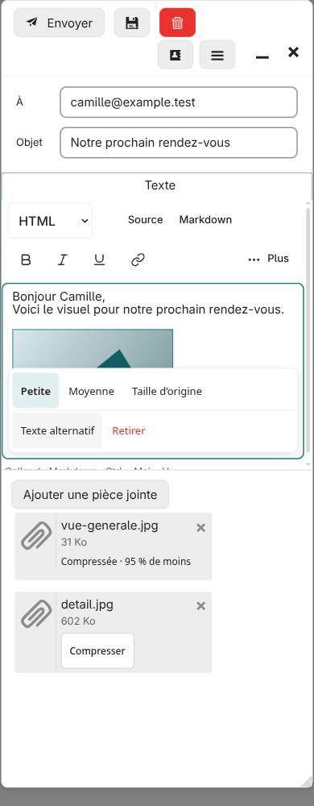
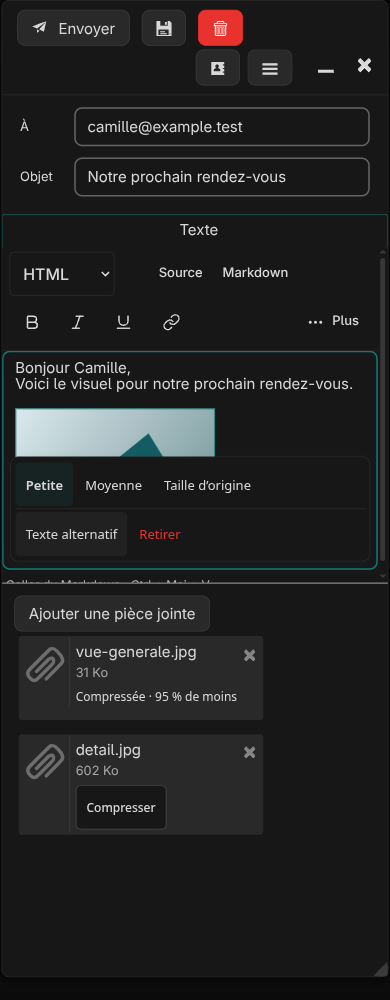

# Pied Web for NextSnapMail

A responsive theme and companion plugin for NextSnapMail inside Nextcloud. Clearer folders and message actions, Markdown composition, image controls and a floating five-second Undo Send.

Independent customization, not an official NextSnapMail or Nextcloud release.



## Included

- Clear folder hierarchy, quieter secondary counters and a compact icon sidebar.
- Mobile account identity, usable account menus, consistent icons and message actions.
- Reply, Reply all, Mark unread, visible Unsubscribe and Messages/Conversations switching.
- Conversations show matching Sent replies, including older ones, without storing extra copies.
- Selection of all filtered results across pages, with explicit deletion confirmation.
- Swipe to delete and Delete-key handling for selected list messages.
- Readable interleaved quotations and native message flag controls.
- Floating five-second Undo Send while continuing to use the mailbox.
- Markdown editing and formatted Markdown paste, alongside HTML source and visual editing.
- Copy an open message body as Markdown from the reader toolbar, with compact text for common HTML signatures.
- A lighter editor toolbar with advanced controls behind More.
- Inline image sizing, pointer/keyboard resize, alt text and removal.
- Browser-side compression for clipboard images and local, Nextcloud or restored image attachments.
- Nextcloud files from the Image toolbar, compressed and inserted directly in the message body.
- Genuinely unread drafts at the top of the Inbox feed, with one-click resume.

The optional linked-account unread counter correction is a separate [upstream PR](https://github.com/oe79/NextSnapMail/pull/41) and [version-specific patch](patches/README.md).
Selected UX enhancements are proposed for upstream integration in [NextSnapMail issue #46](https://github.com/oe79/NextSnapMail/issues/46). This public repository provides the prototype and validation history; the proposal asks the maintainer which focused changes to accept and does not claim the plugin can be merged as-is.

This does **not** implement scheduled delivery, a unified inbox or a new vacation responder. Nextcloud invitation import and Sieve use the existing integrations and administrator configuration. Undo Send is a browser delay before SMTP submission, not recall after delivery or a server scheduler.

## Install and maintain

[Nextcloud Calendar](integrations/calendar/README.md) also has a full-window workspace,
with the native app grid beside the event filter. It is installed and versioned separately.

Release **1.7.10**, tested with Nextcloud **34.0.4**, NextSnapMail **0.1.11**, embedded SnappyMail **2.38.2**. Other versions are unverified.

1. Follow [installation and removal](docs/INSTALL.md).
2. Read [what survives upgrades](docs/UPDATES.md).
3. Run the read-only check after an update:

```sh
python3 tools/check-install.py --nextcloud /path/to/nextcloud
```

The plugin is stored in NextSnapMail's data directory, and the theme under Nextcloud's custom themes. Normal updates generally preserve those files. Preserved files do not guarantee compatibility with new DOM, editor or PHP APIs. The optional core patch is overwritten when the app is replaced.

[Unread drafts](docs/UNREAD_DRAFTS.md) · [Image usage and limits](docs/IMAGES.md) · [Maintenance memory](docs/MAINTENANCE.md) · [Product decisions](docs/CONTEXT.md)

## Develop

No dependency download is needed to use the included release. Third-party browser libraries, fonts and icons are vendored with their notices.

```sh
python3 tools/verify.py
python3 -m unittest discover -s tests -p 'test_*.py'
python3 tools/package.py
```

`verify.py` checks payload hashes, JS/PHP syntax and a reproducible theme build. Run it with Python 3.9+, Node.js and PHP 8.1+. The library version matrix and third-party licenses are documented in [THIRD_PARTY.md](THIRD_PARTY.md).

[Tests and browser fixtures](tests/README.md) use a separate upstream source checkout and fictional mail data. [Release notes](CHANGELOG.md) record the published baseline and its validation boundaries.

 

## License

AGPL-3.0-only for this project, consistent with NextSnapMail. Bundled third-party components retain their respective licenses and attribution. See [LICENSE](LICENSE) and [THIRD_PARTY.md](THIRD_PARTY.md).
